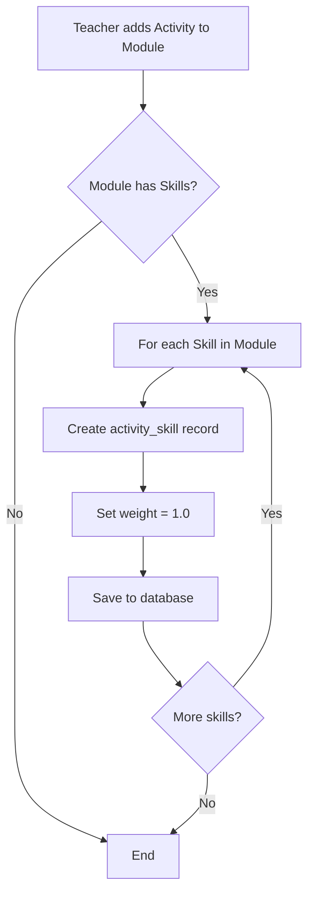
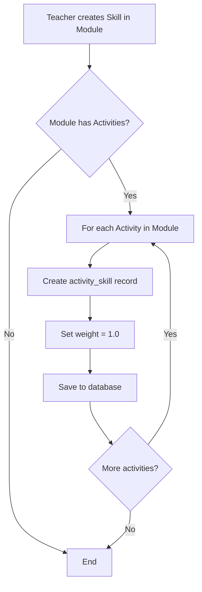
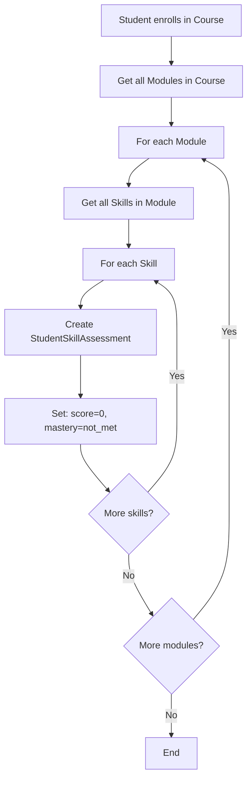
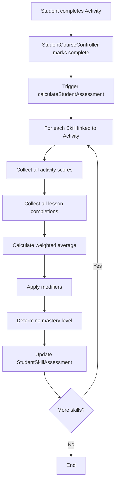

# Skill Assessment System - Technical Documentation
## Overview
The Skill Assessment System is a comprehensive competency-based learning framework integrated into AstroLearn LMS. It tracks student mastery of specific learning outcomes (skills) across multiple assessment components (activities and lessons).
**Version:** 1.0
**Implemented:** March 2026
**Status:**  Production Ready
---
## Table of Contents
1. [System Architecture](#system-architecture)
2. [Database Schema](#database-schema)
3. [Core Components](#core-components)
4. [Automated Workflows](#automated-workflows)
5. [Calculation Logic](#calculation-logic)
6. [API Reference](#api-reference)
7. [Testing](#testing)
8. [Best Practices](#best-practices)
---
## System Architecture
### High-Level Flow
```
Module → Skills → Activities/Lessons
                    ↓
              StudentSkillAssessment
                    ↓
           Mastery Level Determination
```
### Component Relationships
```
┌─────────────┐
│   Module    │
└──────┬──────┘
       │
       ├──→ ┌─────────┐      ┌────────────┐
       │    │  Skill  │ ←──→ │  Activity  │
       │    └────┬────┘      └─────┬──────┘
       │         │                  │
       │         │                  │
       └──→ ┌───┴────┐       ┌─────┴──────┐
            │ Lesson │       │  Student   │
            └───┬────┘       └─────┬──────┘
                │                  │
                └──────┬───────────┘
                       │
                       ▼
            ┌────────────────────────┐
            │ StudentSkillAssessment │
            └────────────────────────┘
```
---
## Database Schema
### 1. `skills` Table
Defines learning outcomes/competencies for a module.
```sql
CREATE TABLE skills (
    id BIGINT UNSIGNED AUTO_INCREMENT PRIMARY KEY,
    module_id BIGINT UNSIGNED NOT NULL,
    name VARCHAR(255) NOT NULL,
    description TEXT,
    competency_threshold DECIMAL(5,2) DEFAULT 70.00,
    created_at TIMESTAMP NULL,
    updated_at TIMESTAMP NULL,
    FOREIGN KEY (module_id) REFERENCES modules(id) ON DELETE CASCADE,
    INDEX idx_skills_module (module_id)
);
```
**Fields:**
- `module_id`: Parent module containing this skill
- `name`: Skill name (e.g., "Critical Thinking")
- `description`: Detailed skill description
- `competency_threshold`: Minimum score percentage for "meets" mastery (default: 70%)
---
### 2. `activity_skill` Pivot Table
Links activities to skills with weighted importance.
```sql
CREATE TABLE activity_skill (
    id BIGINT UNSIGNED AUTO_INCREMENT PRIMARY KEY,
    activity_id BIGINT UNSIGNED NOT NULL,
    skill_id BIGINT UNSIGNED NOT NULL,
    weight DECIMAL(3,2) DEFAULT 1.00,
    created_at TIMESTAMP NULL,
    updated_at TIMESTAMP NULL,
    FOREIGN KEY (activity_id) REFERENCES activities(id) ON DELETE CASCADE,
    FOREIGN KEY (skill_id) REFERENCES skills(id) ON DELETE CASCADE,
    UNIQUE KEY unique_activity_skill (activity_id, skill_id),
    INDEX idx_activity_skill_activity (activity_id),
    INDEX idx_activity_skill_skill (skill_id)
);
```
**Fields:**
- `activity_id`: Activity contributing to skill
- `skill_id`: Skill being assessed
- `weight`: Importance multiplier (default: 1.0; range: 0.1 - 2.0)
**Auto-Population:**
- When activity added to module → links to all module skills
- When skill created in module → links to all module activities
---
### 3. `student_skill_assessments` Table
Tracks individual student mastery of each skill.
```sql
CREATE TABLE student_skill_assessments (
    id BIGINT UNSIGNED AUTO_INCREMENT PRIMARY KEY,
    student_id BIGINT UNSIGNED NOT NULL,
    skill_id BIGINT UNSIGNED NOT NULL,
    normalized_score DECIMAL(5,2) DEFAULT 0.00,
    feedback_score DECIMAL(5,2) DEFAULT 0.00,
    peer_review_score DECIMAL(5,2) DEFAULT 0.00,
    attempt_count INT DEFAULT 0,
    improvement_factor DECIMAL(4,2) DEFAULT 1.00,
    days_late INT DEFAULT 0,
    final_score DECIMAL(5,2) DEFAULT 0.00,
    mastery_level ENUM('exceeds', 'meets', 'approaching', 'not_met') DEFAULT 'not_met',
    consistency_score DECIMAL(5,2) DEFAULT 0.00,
    assessment_metadata JSON,
    created_at TIMESTAMP NULL,
    updated_at TIMESTAMP NULL,
    FOREIGN KEY (student_id) REFERENCES students(id) ON DELETE CASCADE,
    FOREIGN KEY (skill_id) REFERENCES skills(id) ON DELETE CASCADE,
    UNIQUE KEY unique_student_skill (student_id, skill_id),
    INDEX idx_student_skill_student (student_id),
    INDEX idx_student_skill_skill (skill_id),
    INDEX idx_mastery_level (mastery_level)
);
```
**Key Fields:**
- `normalized_score`: Weighted average of all components (0-100)
- `feedback_score`: Bonus from instructor feedback (future enhancement)
- `peer_review_score`: Bonus from peer evaluations (future enhancement)
- `attempt_count`: Total attempts across all skill activities
- `improvement_factor`: Multiplier based on attempts (encourages retries)
- `days_late`: Total late days across submissions
- `final_score`: Final calculated score after all adjustments (0-100)
- `mastery_level`: Competency classification
- `consistency_score`: Standard deviation-based consistency metric (0-100)
- `assessment_metadata`: JSON storing component breakdown
**Metadata Structure:**
```json
{
  "activity_count": 3,
  "lesson_count": 2,
  "total_components": 5,
  "evaluation_date": "2026-03-04 15:43:26"
}
```
---
## Core Components
### 1. Models
#### `Skill.php`
```php
namespace App\Models;
class Skill extends Model
{
    protected $fillable = ['module_id', 'name', 'description', 'competency_threshold'];
    // Relationships
    public function module() { return $this->belongsTo(Module::class); }
    public function activities() { return $this->belongsToMany(Activity::class)->withPivot('weight'); }
    public function studentAssessments() { return $this->hasMany(StudentSkillAssessment::class); }
}
```
#### `StudentSkillAssessment.php`
```php
namespace App\Models;
class StudentSkillAssessment extends Model
{
    protected $fillable = [
        'student_id', 'skill_id', 'normalized_score', 'feedback_score',
        'peer_review_score', 'attempt_count', 'improvement_factor',
        'days_late', 'final_score', 'mastery_level', 'consistency_score',
        'assessment_metadata'
    ];
    protected $casts = ['assessment_metadata' => 'array'];
    // Relationships
    public function student() { return $this->belongsTo(Student::class); }
    public function skill() { return $this->belongsTo(Skill::class); }
}
```
---
### 2. Services
#### `StudentAssessmentService.php`
**Location:** `app/Services/StudentAssessmentService.php`
**Key Methods:**
##### `calculateStudentAssessment(Student $student)`
Recalculates ALL skill assessments for a student.
```php
public function calculateStudentAssessment(Student $student): array
{
    // Get all skills the student should be assessed on
    $skills = $this->getStudentSkills($student);
    $results = [];
    foreach ($skills as $skill) {
        $results[] = $this->calculateOrUpdateSkillAssessment($student, $skill);
    }
    return $results;
}
```
---
##### `calculateOrUpdateSkillAssessment(Student $student, Skill $skill)`
Calculates/updates a single skill assessment.
**Algorithm:**
1. **Collect Performance Data**
   ```php
   $performanceScores = [];
   // Process Activities
   foreach ($skill->activities as $activity) {
       $studentActivity = StudentActivity::find($student, $activity);
       if ($studentActivity) {
           $score = $this->extractActivityScore($studentActivity);
           $weight = $activity->pivot->weight ?? 1.0;
           $performanceScores[] = [
               'score' => $score,
               'weight' => $weight,
               'attempts' => $studentActivity->attempt_count,
               'days_late' => $this->calculateDaysLate($studentActivity),
               'type' => 'activity'
           ];
       }
   }
   // Process Lessons
   foreach ($skill->module->lessons as $lesson) {
       $completion = LessonCompletion::find($student, $lesson);
       if ($completion) {
           $performanceScores[] = [
               'score' => 100.0,  // Completed = 100%
               'weight' => 0.5,   // Half weight vs activities
               'attempts' => 1,
               'days_late' => 0,
               'type' => 'lesson'
           ];
       }
   }
   ```
2. **Calculate Normalized Score**
   ```php
   $normalizedScore = $this->calculateNormalizedScore($performanceScores);
   ```
   Formula:
   ```
   Normalized Score = Σ(score × weight) / Σ(weight)
   ```
3. **Apply Modifiers**
   ```php
   $finalScore = $normalizedScore
       + ($feedbackBonus * 0.1)
       + ($peerReviewBonus * 0.1)
       + ($improvementFactor - 1) * 10
       - $latePenalty;
   $finalScore = max(0, min(100, $finalScore)); // Clamp 0-100
   ```
4. **Determine Mastery Level**
   ```php
   $threshold = $skill->competency_threshold;
   if ($finalScore >= $threshold + 15) return 'exceeds';
   if ($finalScore >= $threshold) return 'meets';
   if ($finalScore >= $threshold - 15) return 'approaching';
   return 'not_met';
   ```
5. **Calculate Consistency**
   ```php
   $consistencyScore = $this->calculateConsistencyScore($performanceScores);
   ```
   Uses standard deviation:
   ```
   Consistency = 100 - (σ / mean × 100)
   ```
6. **Update Database**
   ```php
   StudentSkillAssessment::updateOrCreate(
       ['student_id' => $student->id, 'skill_id' => $skill->id],
       [
           'normalized_score' => $normalizedScore,
           'final_score' => $finalScore,
           'mastery_level' => $mastery,
           'consistency_score' => $consistencyScore,
           'assessment_metadata' => [
               'activity_count' => $activityCount,
               'lesson_count' => $lessonCount,
               'total_components' => count($performanceScores)
           ]
       ]
   );
   ```
---
### 3. Controllers
#### `ModuleController.php`
**Method:** `addActivities(Request $request, Module $module)`
**Auto-Linking Logic:**
```php
public function addActivities(Request $request, Module $module)
{
    // ... attach activities to module ...
    // Auto-link module skills to new activities
    $this->linkModuleSkillsToActivities($module, $activityIds);
}
protected function linkModuleSkillsToActivities(Module $module, array $activityIds)
{
    $skills = $module->skills;
    foreach ($skills as $skill) {
        foreach ($activityIds as $activityId) {
            // Check if link already exists
            $exists = DB::table('activity_skill')
                ->where('activity_id', $activityId)
                ->where('skill_id', $skill->id)
                ->exists();
            if (!$exists) {
                DB::table('activity_skill')->insert([
                    'activity_id' => $activityId,
                    'skill_id' => $skill->id,
                    'weight' => 1.0,
                    'created_at' => now(),
                    'updated_at' => now()
                ]);
            }
        }
    }
}
```
---
#### `SkillManagementController.php`
**Method:** `store(Request $request)`
**Auto-Linking Logic:**
```php
public function store(Request $request)
{
    $skill = Skill::create([
        'module_id' => $request->module_id,
        'name' => $request->name,
        'description' => $request->description,
        'competency_threshold' => $request->competency_threshold ?? 70
    ]);
    // Auto-link to all module activities
    $this->linkSkillToModuleActivities($skill);
    return redirect()->back();
}
protected function linkSkillToModuleActivities(Skill $skill)
{
    $module = $skill->module;
    $activities = $module->activities;
    foreach ($activities as $activity) {
        $skill->activities()->syncWithoutDetaching([
            $activity->id => ['weight' => 1.0]
        ]);
    }
}
```
---
#### `StudentCourseEnrollmentService.php`
**Method:** `enrollStudentToACourse(...)`
**Auto-Initialization Logic:**
```php
public function enrollStudentToACourse(CourseSchedule $schedule, Student $student, ...)
{
    // ... create enrollment ...
    // Initialize skill assessments
    $this->initializeStudentSkillAssessments($schedule->course, $student);
}
protected function initializeStudentSkillAssessments(Course $course, Student $student)
{
    $modules = $course->modules;
    foreach ($modules as $module) {
        $skills = $module->skills;
        foreach ($skills as $skill) {
            StudentSkillAssessment::firstOrCreate(
                [
                    'student_id' => $student->id,
                    'skill_id' => $skill->id
                ],
                [
                    'final_score' => 0,
                    'normalized_score' => 0,
                    'mastery_level' => 'not_met',
                    'attempt_count' => 0,
                    'consistency_score' => 0,
                    'assessment_metadata' => [
                        'activity_count' => 0,
                        'lesson_count' => 0,
                        'total_components' => 0
                    ]
                ]
            );
        }
    }
}
```
---
## Automated Workflows
### Workflow 1: Activity Added to Module

**Trigger:** `ModuleController@addActivities`
**Auto-executes:** `linkModuleSkillsToActivities()`
**Result:** All module skills linked to new activity
---
### Workflow 2: Skill Created in Module

**Trigger:** `SkillManagementController@store`
**Auto-executes:** `linkSkillToModuleActivities()`
**Result:** New skill linked to all module activities
---
### Workflow 3: Student Enrollment

**Trigger:** `StudentCourseEnrollmentService@enrollStudentToACourse`
**Auto-executes:** `initializeStudentSkillAssessments()`
**Result:** All skill assessments created with default values
---
### Workflow 4: Activity Completion

**Trigger:** `StudentCourseController@completeActivity` or `@completeLesson`
**Auto-executes:** `StudentAssessmentService@calculateStudentAssessment()`
**Result:** All related skill assessments updated in real-time
---
## Calculation Logic
### Component Weighting
| Component Type | Default Weight | Score Range | Notes |
|---------------|---------------|-------------|-------|
| Activity (Quiz) | 1.0 | 0-100% | Based on quiz score |
| Activity (Assignment) | 1.0 | 0-100% | Based on graded score |
| Activity (Assessment) | 1.0 | 0-100% | Based on assessment score |
| Lesson Completion | 0.5 | 100% (if completed) | Binary: completed = 100% |
### Score Calculation Example
**Given:**
- Skill: "Data Analysis" (threshold: 70%)
- Components:
  - Quiz 1: 85% (weight: 1.0)
  - Quiz 2: 90% (weight: 1.0)
  - Assignment 1: 78% (weight: 1.0)
  - Lesson 1: Completed (weight: 0.5)
  - Lesson 2: Completed (weight: 0.5)
  - Lesson 3: Not completed
**Step 1: Calculate Normalized Score**
```
Sum of weighted scores = (85×1.0) + (90×1.0) + (78×1.0) + (100×0.5) + (100×0.5)
                       = 85 + 90 + 78 + 50 + 50
                       = 353
Sum of weights = 1.0 + 1.0 + 1.0 + 0.5 + 0.5
               = 4.0
Normalized Score = 353 / 4.0 = 88.25%
```
**Step 2: Apply Modifiers**
```
Improvement Factor = 1 + (5 attempts - 1) × 0.05 = 1.20
Late Penalty = 3 days late × 1% = 3%
Final Score = 88.25 + (0 × 0.1) + (0 × 0.1) + (1.20 - 1) × 10 - 3
            = 88.25 + 0 + 0 + 2 - 3
            = 87.25%
```
**Step 3: Determine Mastery Level**
```
Threshold = 70%
Score = 87.25%
87.25 >= 70 + 15? → 87.25 >= 85? → True → "exceeds"
```
**Result:**
- Final Score: **87.25%**
- Mastery Level: **exceeds**
- Components: 3 activities + 2 lessons = 5 total
---
### Mastery Level Thresholds
```
| Level        | Condition                         | Example (threshold=70%) |
|--------------|-----------------------------------|-------------------------|
| exceeds      | score >= threshold + 15           | score >= 85%            |
| meets        | score >= threshold                | 70% <= score < 85%      |
| approaching  | score >= threshold - 15           | 55% <= score < 70%      |
| not_met      | score < threshold - 15            | score < 55%             |
```
---
## API Reference
### Endpoints
#### `GET /api/modules/{moduleId}/skills`
Retrieve all skills for a module.
**Response:**
```json
{
  "skills": [
    {
      "id": 1,
      "module_id": 3,
      "name": "Critical Thinking",
      "description": "Ability to analyze and evaluate information",
      "competency_threshold": 70.00,
      "activities_count": 5,
      "created_at": "2026-03-01T10:00:00Z"
    }
  ]
}
```
---
#### `POST /api/modules/{moduleId}/skills`
Create a new skill in a module.
**Request:**
```json
{
  "name": "Problem Solving",
  "description": "Systematic approach to challenges",
  "competency_threshold": 75
}
```
**Response:**
```json
{
  "skill": {
    "id": 2,
    "module_id": 3,
    "name": "Problem Solving",
    "competency_threshold": 75.00,
    "created_at": "2026-03-04T15:30:00Z"
  },
  "activities_linked": 3
}
```
---
#### `GET /api/students/{studentId}/skill-assessments`
Get all skill assessments for a student.
**Response:**
```json
{
  "assessments": [
    {
      "id": 1,
      "student_id": 1,
      "skill_id": 1,
      "skill_name": "Critical Thinking",
      "final_score": 87.25,
      "mastery_level": "exceeds",
      "consistency_score": 92.50,
      "attempt_count": 5,
      "assessment_metadata": {
        "activity_count": 3,
        "lesson_count": 2,
        "total_components": 5
      },
      "updated_at": "2026-03-04T15:43:26Z"
    }
  ]
}
```
---
#### `GET /api/skills/{skillId}/students/{studentId}/assessment`
Get a specific student's assessment for a skill.
**Response:**
```json
{
  "assessment": {
    "skill": {
      "id": 1,
      "name": "Critical Thinking",
      "competency_threshold": 70.00
    },
    "student": {
      "id": 1,
      "name": "John Doe"
    },
    "scores": {
      "normalized_score": 88.25,
      "final_score": 87.25,
      "consistency_score": 92.50
    },
    "mastery_level": "exceeds",
    "components": {
      "activities": [
        {"id": 1, "name": "Quiz 1", "score": 85, "weight": 1.0},
        {"id": 2, "name": "Quiz 2", "score": 90, "weight": 1.0},
        {"id": 3, "name": "Assignment 1", "score": 78, "weight": 1.0}
      ],
      "lessons": [
        {"id": 1, "name": "Lesson 1", "completed": true, "weight": 0.5},
        {"id": 2, "name": "Lesson 2", "completed": true, "weight": 0.5}
      ]
    }
  }
}
```
---
## Testing
### Test Files Created
1. **`test_skill_assessment_flow.php`**
   - Tests basic skill-activity linking
   - Verifies StudentSkillAssessment creation
   - Validates score calculation
2. **`test_enrollment_skill_init.php`**
   - Tests enrollment triggers skill assessment initialization
   - Verifies default values (score=0, mastery=not_met)
   - Confirms proper record creation
3. **`test_lesson_skill_assessment.php`**
   - Tests lesson completion triggers assessment update
   - Verifies lesson contributes to skill score
   - Validates weight application (0.5 for lessons)
4. **`test_combined_assessment.php`**
   - Tests combined activity + lesson evaluation
   - Verifies weighted average calculation
   - Validates mastery level determination
### Running Tests
```bash
# Run individual test
php test_skill_assessment_flow.php
# Run all skill assessment tests
php test_enrollment_skill_init.php
php test_lesson_skill_assessment.php
php test_combined_assessment.php
```
### Expected Test Output
```
=== Testing Combined Activity + Lesson Skill Assessment ===
Student: Student 1 (ID: 1)
Module: Module 3 (ID: 3)
Skills: 1
Activities: 1
Lessons: 1
Testing Skill: Data Analysis
Threshold: 70.00%
--- Activities Linked to Skill ---
Count: 1
   Quiz 1 (has progress)
--- Lesson Completions in Module ---
Completed: 1 / 1
   Lesson 1
--- Calculating Skill Assessment ---
 Skill Assessment Created/Updated
Final Score: 92.50%
Normalized Score: 92.50%
Mastery Level: exceeds
Consistency Score: 100.00
Attempt Count: 2
Breakdown:
  Activities: 1
  Lessons: 1
  Total Components: 2
```
---
## Best Practices
### For Developers
1. **Always use the service layer** for skill assessment calculations
   -  `StudentAssessmentService::calculateStudentAssessment($student)`
   -  Direct database updates to `student_skill_assessments`
2. **Trigger recalculation on any score change**
   ```php
   // After updating activity score
   $studentAssessmentService->calculateStudentAssessment($student);
   ```
3. **Use transactions for skill creation with activities**
   ```php
   DB::transaction(function() use ($skill, $activities) {
       $skill->save();
       $skill->activities()->attach($activities);
   });
   ```
4. **Validate competency thresholds**
   ```php
   $validated = $request->validate([
       'competency_threshold' => 'numeric|min:0|max:100'
   ]);
   ```
5. **Index queries on mastery_level for filtering**
   ```php
   // Efficient query with index
   $struggling = StudentSkillAssessment::where('mastery_level', 'not_met')->get();
   ```
---
### For Instructors
1. **Define 3-5 key skills per module** (avoid skill overload)
2. **Set realistic competency thresholds** (70-80% typical)
3. **Balance activity and lesson content** (both contribute to skills)
4. **Review skill assessments weekly** to identify struggling students
5. **Align skills with course learning objectives**
---
### For Students
1. **Check skill assessments regularly** on dashboard
2. **Focus on "not_met" and "approaching" skills** first
3. **Complete lessons** for baseline skill progress (easy 100%)
4. **Retake activities** to improve specific skill scores
5. **Aim for "meets" or "exceeds"** on all skills before exams
---
## Troubleshooting
### Issue: Skill assessment not updating after activity completion
**Diagnosis:**
```php
// Check if activity is linked to skill
$linked = DB::table('activity_skill')
    ->where('activity_id', $activityId)
    ->where('skill_id', $skillId)
    ->exists();
if (!$linked) {
    echo "Activity not linked to skill!";
}
```
**Solution:**
```php
// Manually link activity to skill
$skill->activities()->syncWithoutDetaching([
    $activityId => ['weight' => 1.0]
]);
```
---
### Issue: Student skill assessments not initialized on enrollment
**Diagnosis:**
```php
// Check enrollment trigger
$enrollment = CourseEnrollment::find($enrollmentId);
$assessments = StudentSkillAssessment::where('student_id', $enrollment->student_id)->get();
echo "Assessments found: " . $assessments->count();
```
**Solution:**
```php
// Manually initialize
$service = app(StudentCourseEnrollmentService::class);
$service->initializeStudentSkillAssessments($course, $student);
```
---
### Issue: Inconsistent mastery levels across students
**Diagnosis:**
```php
// Check competency thresholds
$skills = Skill::all();
foreach ($skills as $skill) {
    echo "{$skill->name}: {$skill->competency_threshold}%\n";
}
```
**Solution:**
Standardize thresholds across similar skills:
```php
Skill::where('module_id', $moduleId)
    ->update(['competency_threshold' => 70]);
```
---
## Future Enhancements
### Planned Features
1. **Skill Prerequisites**
   - Require mastery of Skill A before accessing Skill B
   - Implement prerequisite validation in enrollment
2. **Skill Recommendations**
   - AI-powered activity suggestions based on weak skills
   - Personalized learning paths
3. **Skill Portfolio**
   - Student-facing skill mastery dashboard
   - Exportable skill transcript (PDF)
   - Shareable skill badges
4. **Advanced Analytics**
   - Skill mastery heatmaps by cohort
   - Skill progression timelines
   - Predictive analytics for at-risk students
5. **Peer Skill Assessment**
   - Students rate each other's demonstrated skills
   - Peer review score integration in final_score
6. **Instructor Feedback Integration**
   - Qualitative feedback tied to specific skills
   - Feedback score contribution to assessment
7. **Skill-Based Certification**
   - Auto-generate certificates when all skills "meet" or "exceed"
   - Blockchain-verified skill credentials
---
## Version History
| Version | Date | Changes |
|---------|------|---------|
| 1.0 | 2026-03-04 | Initial release with core functionality |
| | | - Auto-linking of skills to activities |
| | | - Enrollment initialization |
| | | - Activity + Lesson evaluation |
| | | - Real-time mastery calculation |
---
## Contributors
- Development Team: AstroLearn Engineering
- Documentation: System Architect
- Testing: QA Team
---
## License
Proprietary - AstroLearn LMS
All rights reserved.
---
## Support
For technical support:
- Email: support@astrolearn.edu
- Documentation: `/documentation` route in app
- GitHub Issues: [Repository URL]
---
**Last Updated:** March 4, 2026
**Status:**  Production Ready
